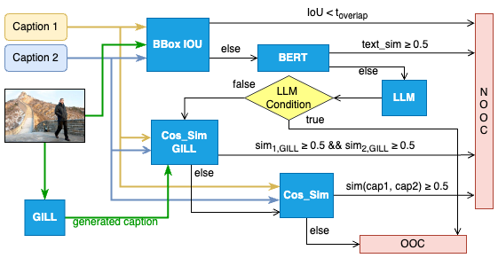

# ACM ICMR 2024 - Grand Challenge on Detecting Cheapfakes Source Code

# Authors
| No. | Author                       | Email | ORCID |
|-----|------------------------------|-------|-------|
| 1   | Dang Vu*          | 23c15023@student.hcmus.edu.vn | 0009-0003-3268-024X |
| 2   | Quoc-Trun Nguyen* | 21120107@student.hcmus.edu.vn | 0009-0008-3746-389X |
| 3   | Minh-Nhat Nguyen* | 21120350@student.hcmus.edu.vn | 0009-0001-5959-6107 |

(*** All authors contributed equally to this research.)

# Description
This source code is based on COSMOS algorithm, used for Cheapfake Challenge ICMR 2024 - Task 1

# Workflow
<!--  -->

  
  <figcaption>Overall Workflow</figcaption>

# Instruction for evaluating source code
Please refer [`icmr2024_cheapfakes_challenge.ipynb`](icmr2024_cheapfake_challenge.ipynb) for setup environment and running experiment on Colab

**Note:** This experiment can be run on Google Colab Pro with **A100 GPU + High-ram runtime**

# Experimental Result
## Dataset
In our experiment, we use the original dataset taken from the IEEE ICME 2023 Grand Challenge on Detecting Cheapfakes with 1000 samples in public test set. Each of which consisted of an image and two captions as inputs, along with the corresponding OOC or NOOC labels.

## Metrics
We use accuracy to evaluate our proposed method in this challenge. Accuracy is defined as the ratio of correct predictions to the number of samples in the test set. The formula for accuracy is as follows:

$$ accuracy = \frac{TP + TN}{TP + TN + FP + FN}$$

where:
* $TP$ is the number of true positive predictions (detected OOC)
* $TN$ is the number of true negative predictions (detected
NOOC).
* $FP$ is the number of false positive predictions (NOOC but
predicted as OOC).
* $FN$ is the number of false negative predictions (OOC but predicted as NOOC).

## Result
Accuracy: 
* COSMOS baseline: 81.9%
* **Our method: 82.9%**
